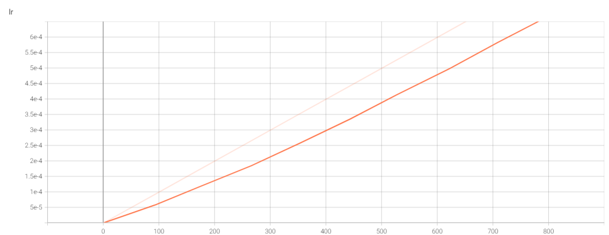
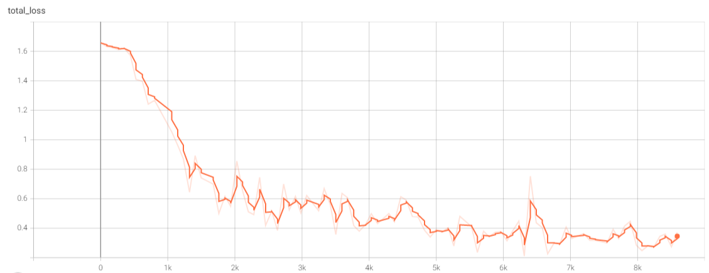
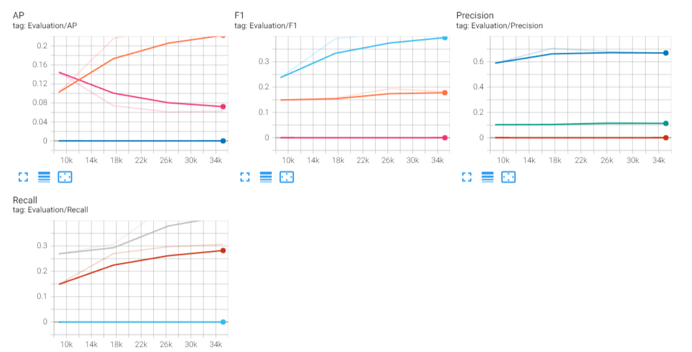
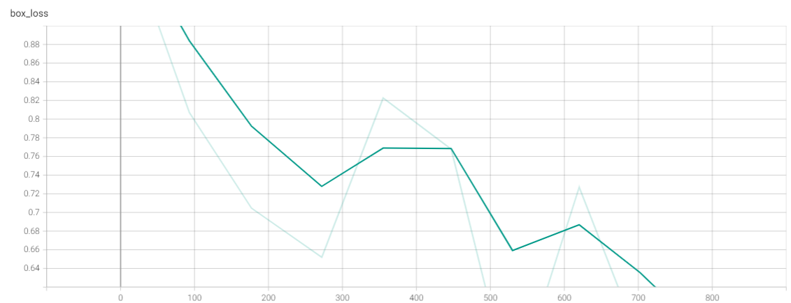
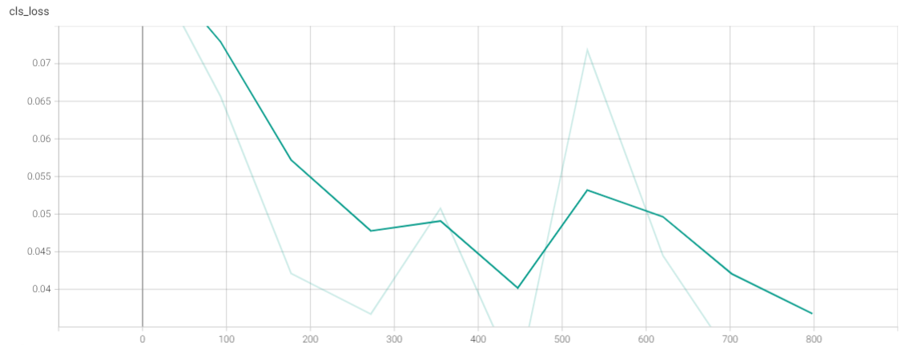
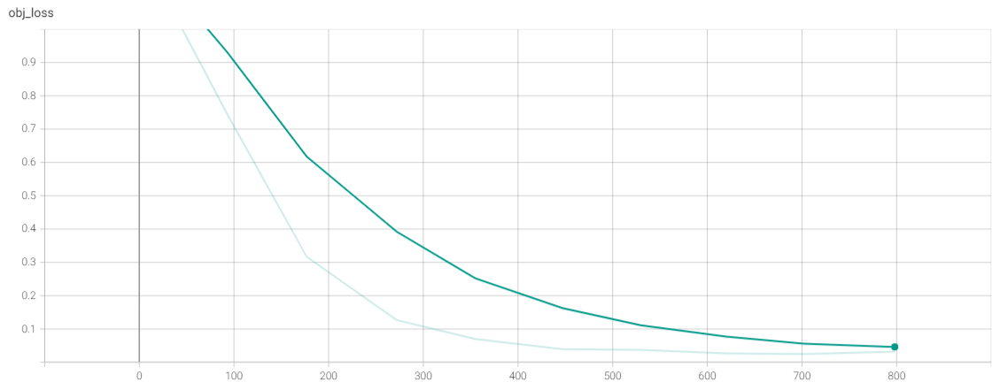
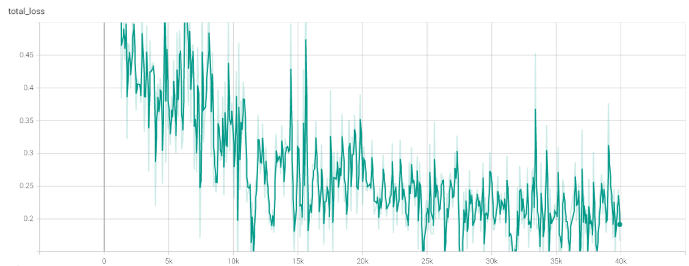
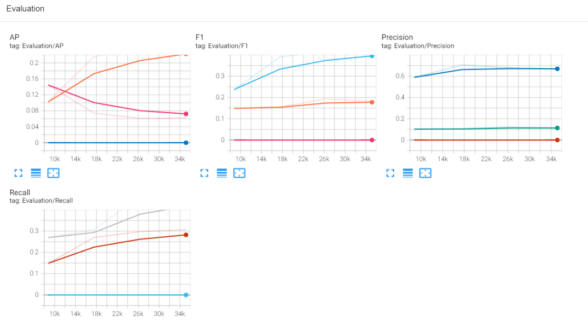

# Augmentation DefaultAug + sometimes(iaa.OneOf([color])) 적용


사용한 알고리즘
- optimizer : SGD, momentum 0.9, decay 0.0005
- learning rate : 0.001
- loss function : bcelogloss
- lr_scheduler : MultiStepLR, gamma - 0.5, milestones : [10000,20000,30000]
- lcls : 0.05
- lobj : 1.0
- lbox : 0.5

<br>

- boxloss


- clsloss


- latency


- learning rate


- objectness loss


- total loss


- evaluation


<br>
```bash
epoch 0 / iter 94 lr 0.00009 , loss 1.63090 latency 0.01700
epoch 6 / iter 1060 lr 0.00100 , loss 1.05310 latency 0.01300
epoch 19 / iter 3421 lr 0.00100 , loss 0.55963 latency 0.01700
epoch 28 / iter 5001 lr 0.00100 , loss 0.39045 latency 0.01400
epoch 55 / iter 9655 lr 0.00100 , loss 0.31075 latency 0.01800
+-------+-------+---------+-----------+---------+---------+
| Index | Class | AP      | Precision | Recall  | f1      |
+-------+-------+---------+-----------+---------+---------+
| 0     | left  | 0.10242 | 0.58929   | 0.14865 | 0.23741 |
| 1     | right | 0.14470 | 0.10294   | 0.26923 | 0.14894 |
| 2     | stop  | 0.00000 | 0.00000   | 0.00000 | 0.00000 |
+-------+-------+---------+-----------+---------+---------+
epoch 87 / iter 15269 lr 0.00050 , loss 0.22266 latency 0.01700
epoch 88 / iter 15452 lr 0.00050 , loss 0.20049 latency 0.01697
epoch 88 / iter 15545 lr 0.00050 , loss 0.22134 latency 0.01408
epoch 89 / iter 15720 lr 0.00050 , loss 0.18699 latency 0.01616
+-------+-------+---------+-----------+---------+---------+
| 0     | left  | 0.21577 | 0.70588   | 0.27027 | 0.39088 |
| 1     | right | 0.07394 | 0.10526   | 0.30769 | 0.15686 |
| 2     | stop  | 0.00000 | 0.00000   | 0.00000 | 0.00000 |
+-------+-------+---------+-----------+---------+---------+
epoch 139 / iter 24543 lr 0.00025 , loss 0.19121 latency 0.02097
epoch 140 / iter 24627 lr 0.00025 , loss 0.16512 latency 0.01822
epoch 140 / iter 24719 lr 0.00025 , loss 0.13650 latency 0.01227
+-------+-------+---------+-----------+---------+---------+
| Index | Class | AP      | Precision | Recall  | f1      |
+-------+-------+---------+-----------+---------+---------+
| 0     | left  | 0.23715 | 0.68041   | 0.29730 | 0.41379 |
| 1     | right | 0.06106 | 0.12245   | 0.46154 | 0.19355 |
| 2     | stop  | 0.00000 | 0.00000   | 0.00000 | 0.00000 |
+-------+-------+---------+-----------+---------+---------+
epoch 184 / iter 32460 lr 0.00013 , loss 0.19841 latency 0.01697
epoch 185 / iter 32546 lr 0.00013 , loss 0.26502 latency 0.01700
epoch 185 / iter 32639 lr 0.00013 , loss 0.13934 latency 0.01700
epoch 186 / iter 32723 lr 0.00013 , loss 0.19028 latency 0.01400
epoch 186 / iter 32817 lr 0.00013 , loss 0.08318 latency 0.01501
+-------+-------+---------+-----------+---------+---------+
| Index | Class | AP      | Precision | Recall  | f1      |
+-------+-------+---------+-----------+---------+---------+
| 0     | left  | 0.24176 | 0.66667   | 0.30631 | 0.41975 |
| 1     | right | 0.06257 | 0.11321   | 0.46154 | 0.18182 |
| 2     | stop  | 0.00000 | 0.00000   | 0.00000 | 0.00000 |
+-------+-------+---------+-----------+---------+---------+
```
epoch가 50 이상 넘어가는 순간부터 큰 차이 없음

<br>

사용한 알고리즘
- optimizer : Adam, decay 0.0005
- learning rate : 0.001
- loss function : bcelogloss
- lr_scheduler : MultiStepLR, gamma - 0.5, milestones : [10000,20000,30000]
- lcls : 0.05
- lobj : 1.0
- lbox : 0.5

<br>

- boxloss


- clsloss


- latency


- learning rate


- objectness loss


- total loss


- evaluation


```bash
epoch 0 / iter 93 lr 0.00009 , loss 1.61756 latency 0.01900
epoch 6 / iter 1054 lr 0.00100 , loss 0.57513 latency 0.01400
epoch 19 / iter 3457 lr 0.00100 , loss 0.27258 latency 0.01700
epoch 28 / iter 5036 lr 0.00100 , loss 0.34554 latency 0.01800
epoch 49 / iter 8647 lr 0.00100 , loss 0.24115 latency 0.01800
+-------+-------+---------+-----------+---------+---------+
| Index | Class | AP      | Precision | Recall  | f1      |
+-------+-------+---------+-----------+---------+---------+
| 0     | left  | 0.17596 | 0.55856   | 0.27928 | 0.37237 |
| 1     | right | 0.02367 | 0.06173   | 0.19231 | 0.09346 |
| 2     | stop  | 0.02041 | 1.00000   | 0.02041 | 0.04000 |
+-------+-------+---------+-----------+---------+---------+
epoch 86 / iter 15160 lr 0.00050 , loss 0.17233 latency 0.01398
epoch 86 / iter 15254 lr 0.00050 , loss 0.22358 latency 0.01500
epoch 87 / iter 15334 lr 0.00050 , loss 0.19079 latency 0.01400
epoch 87 / iter 15426 lr 0.00050 , loss 0.42816 latency 0.01500
+-------+-------+---------+-----------+---------+---------+
| Index | Class | AP      | Precision | Recall  | f1      |
+-------+-------+---------+-----------+---------+---------+
| 0     | left  | 0.44480 | 0.75460   | 0.55405 | 0.63896 |
| 1     | right | 0.07186 | 0.07273   | 0.46154 | 0.12565 |
| 2     | stop  | 0.00000 | 0.00000   | 0.00000 | 0.00000 |
+-------+-------+---------+-----------+---------+---------+
epoch 138 / iter 24318 lr 0.00025 , loss 0.15278 latency 0.02300
epoch 138 / iter 24408 lr 0.00025 , loss 0.28720 latency 0.02500
epoch 139 / iter 24494 lr 0.00025 , loss 0.24700 latency 0.01998
epoch 139 / iter 24585 lr 0.00025 , loss 0.15721 latency 0.02001
epoch 140 / iter 24671 lr 0.00025 , loss 0.10320 latency 0.01400

+-------+-------+---------+-----------+---------+---------+
| Index | Class | AP      | Precision | Recall  | f1      |
+-------+-------+---------+-----------+---------+---------+
| 0     | left  | 0.48650 | 0.70000   | 0.59910 | 0.64563 |
| 1     | right | 0.06381 | 0.08163   | 0.61538 | 0.14414 |
| 2     | stop  | 0.00000 | 0.00000   | 0.00000 | 0.00000 |
+-------+-------+---------+-----------+---------+---------+
epoch 184 / iter 32509 lr 0.00013 , loss 0.18515 latency 0.02000
epoch 185 / iter 32590 lr 0.00013 , loss 0.20475 latency 0.01900
epoch 185 / iter 32684 lr 0.00013 , loss 0.21515 latency 0.01400
epoch 186 / iter 32766 lr 0.00013 , loss 0.27849 latency 0.02099
epoch 186 / iter 32853 lr 0.00013 , loss 0.15556 latency 0.01700
epoch 187 / iter 32941 lr 0.00013 , loss 0.19999 latency 0.01600
epoch 187 / iter 33034 lr 0.00013 , loss 0.17985 latency 0.02100
+-------+-------+---------+-----------+---------+---------+
| Index | Class | AP      | Precision | Recall  | f1      |
+-------+-------+---------+-----------+---------+---------+
| 0     | left  | 0.52654 | 0.73846   | 0.64865 | 0.69065 |
| 1     | right | 0.08352 | 0.09140   | 0.65385 | 0.16038 |
| 2     | stop  | 0.00000 | 0.00000   | 0.00000 | 0.00000 |
+-------+-------+---------+-----------+---------+---------+
```