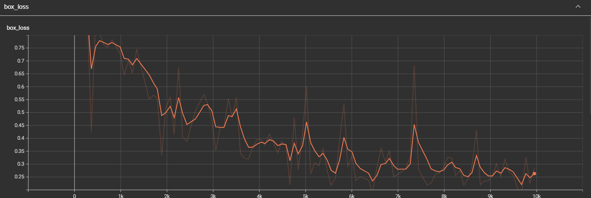
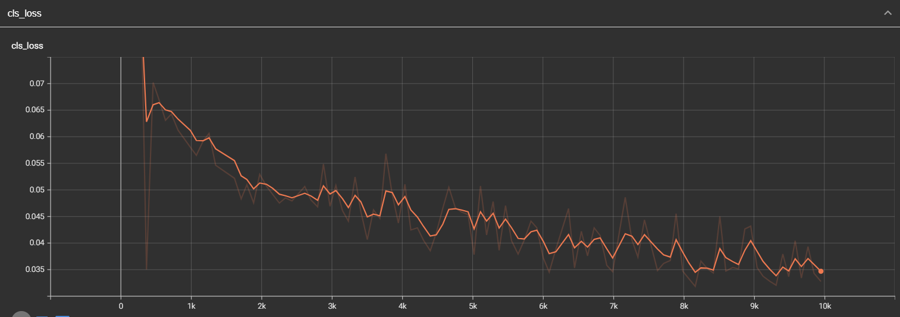
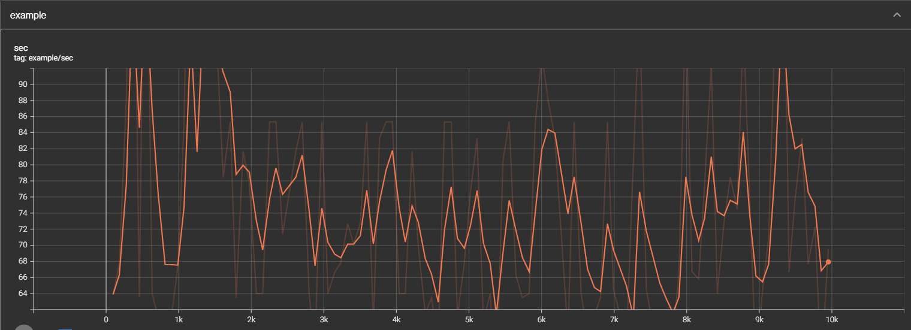
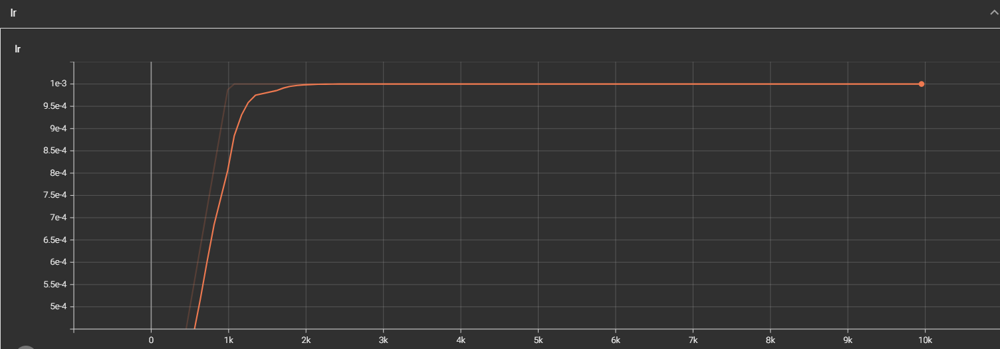
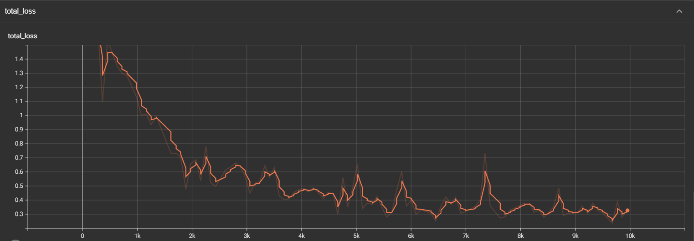
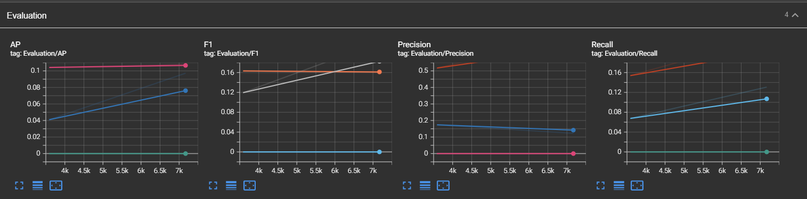

# 초기 모델

- boxloss


- clsloss


- latency


- learning rate


- objectness loss


- total loss


- evaluation


<br>

사용한 알고리즘
- optimizer : SGD, momentum 0.9, decay 0.0005
- learning rate : 0.001
- loss function : bcelogloss
- lr_scheduler : MultiStepLR, gamma - 0.5, milestones : [10000,20000,30000]
- lcls : 0.5
- lobj : 1.0
- lbox : 0.05

```bash
epoch 0 / iter 96 lr 0.00010 , loss 1.64410 latency 0.04697
epoch 6 / iter 1073 lr 0.00100 , loss 1.00232 latency 0.03125
epoch 19 / iter 3523 lr 0.00100 , loss 0.25401 latency 0.02698
epoch 28 / iter 5137 lr 0.00100 , loss 0.25522 latency 0.03165
epoch 55 / iter 9952 lr 0.00100 , loss 0.34121 latency 0.03124
```

bcelogloss는 2개의 클래스를 가질 때 사용하는 loss이다. beclogloss를 사용하기 위해서는 output shape이 [num_batch, 1]로 나와야 하고, 마지막 output 값들이 0~1값으로 나와야 하므로 마지막에 activation function을 추가해줘야 한다.

<br>

<br>

## fitting loss weight

- lcls : 0.5
- lobj : 1.0
- lbox : 0.05

```bash
epoch 0 / iter 96 lr 0.00010 , loss 1.64410 latency 0.04697
epoch 6 / iter 1073 lr 0.00100 , loss 1.00232 latency 0.03125
epoch 28 / iter 5021 lr 0.00100 , loss 0.65669 latency 0.02645
epoch 55 / iter 9952 lr 0.00100 , loss 0.34121 latency 0.03124
```

<br>

- **lcls : 0.05**
- **lobj : 1.0**
- **lbox : 0.5**

```bash
epoch 0 / iter 1 lr 0.00000 , loss 1.62597 latency 0.01804
epoch 6 / iter 1076 lr 0.00100 , loss 0.84359 latency 0.03100
epoch 28 / iter 5044 lr 0.00100 , loss 0.50940 latency 0.03125
epoch 50 / iter 9109 lr 0.00100 , loss 0.05907 latency 0.01700
```

성능이 확실히 좋아졌음

<br>

- lcls : 0.25
- lobj : 1.0
- lbox : 0.25

```bash
epoch 0 / iter 1 lr 0.00000 , loss 1.53861 latency 0.01560
epoch 6 / iter 1069 lr 0.00100 , loss 0.95907 latency 0.03126
```

x

<br>

- lcls : 0.05
- lobj : 0.5
- lbox : 0.5

```bash
epoch 0 / iter 1 lr 0.00000 , loss 1.35323 latency 0.32276
epoch 6 / iter 1078 lr 0.00100 , loss 0.97386 latency 0.03800
epoch 19 / iter 3511 lr 0.00100 , loss 0.57411 latency 0.04000
```

<br>

## optimizer

원래는 SGD

Adam으로 변경

- lcls : 0.05
- lobj : 1.0
- lbox : 0.5

```bash
epoch 0 / iter 1 lr 0.00000 , loss 1.67407 latency 0.34670

```


<br>

## scheduler

